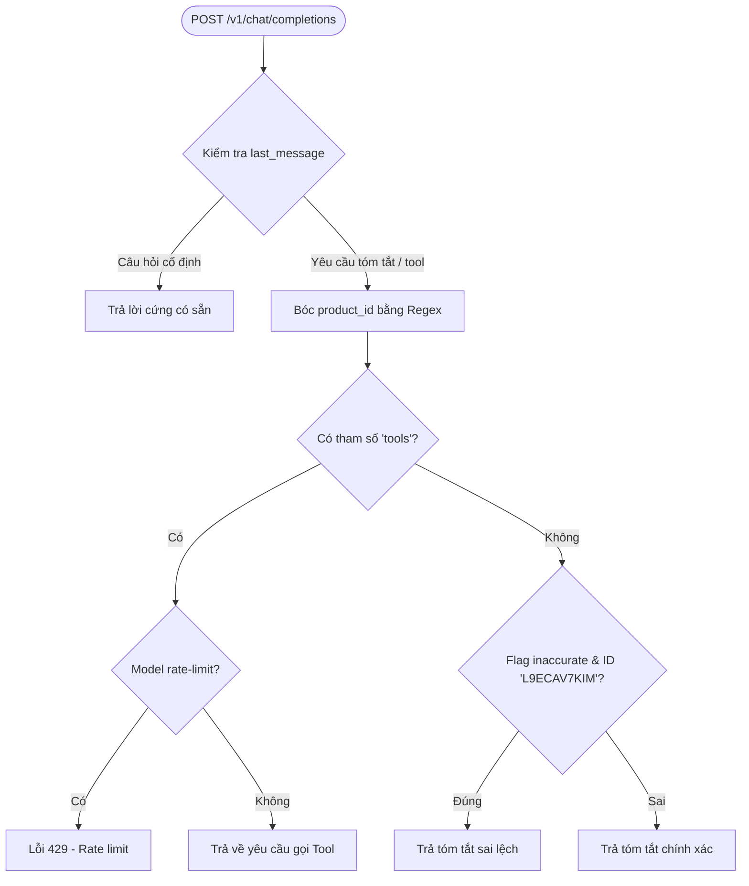

# LLM

The LLM service is used by the Product Review service to provide
AI-generated summaries of product reviews.

While it's not an actual Large Language Model, the LLM pretends to be one
by following the [OpenAI API format for chat completions](https://platform.openai.com/docs/api-reference/chat/create).

The Product Review service is then instrumented with the
[opentelemetry-instrumentation-openai-v2](https://pypi.org/project/opentelemetry-instrumentation-openai-v2/)
package, allowing us to capture Generative AI related span attributes when
it interacts with the LLM service.

The first request to the `/v1/chat/completions` endpoint should include a
database tool. The LLM service then responds with a request to execute the
tool.

The second request to the `/v1/chat/completions` endpoint should include the
results of the database tool call (which is the list of product reviews for
the specified product).  It then responds with the summary of product reviews
for that product.  Note that the summaries were pre-generated using
an LLM, and are stored in a JSON file to avoid calling an actual LLM each time.

The service supports two feature flags:

* `llmInaccurateResponse`: when this feature flag is enabled the LLM service
returns an inaccurate product summary for product ID L9ECAV7KIM
* `llmRateLimitError`: when this feature flag is enabled, the LLM service
intermittently returns a RateLimitError with HTTP status code 429

Note that the LLM service itself is not instrumented with OpenTelemetry.
This is intentional, as we're treating it like a black box, just like
most 3rd party LLMs would be treated.

---

## Sơ đồ luồng hoạt động (Rút gọn)

---

## Chi tiết Luồng hoạt động (Code Flow) của app.py

### 1. Khởi chạy Dịch vụ (Initialization Flow)
1. Cấu hình **OpenFeature Provider** với dịch vụ `flagd` để theo dõi các Feature Flag.
2. Tải danh sách tóm tắt review **chính xác** (`product-review-summaries.json`) vào bộ nhớ dưới dạng dictionary (key: `product_id`, value: tóm tắt review).
3. Tải danh sách tóm tắt review **sai lệch** (`inaccurate-product-review-summaries.json`) vào bộ nhớ.
4. Chạy Flask Server trên cổng `8000`.

### 2. Xử lý yêu cầu Chat Completion (POST `/v1/chat/completions`)
Khi nhận một yêu cầu POST, luồng xử lý diễn ra như sau:
* **Bước 1: Trích xuất thông tin**
  * Lấy JSON payload từ request body (gồm `messages`, `tools`, `model`).
  * Xác định tin nhắn cuối cùng (`last_message`).
* **Bước 2: Xử lý các câu hỏi cố định (Fast Paths)**
  * *Nếu hỏi về độ tuổi khuyến nghị* (`What age(s) is this recommended for?`) -> Trả về câu trả lời cố định: `This product is recommended for ages 7 and above.`
  * *Nếu hỏi về review tiêu cực* (`Were there any negative reviews?`) -> Trả về câu trả lời cố định: `No, there were no reviews less than three stars for this product.`
  * *Nếu không phải câu hỏi tóm tắt và không phải kết quả của tool* -> Từ chối: `Sorry, I'm not able to answer that question.`
* **Bước 3: Lấy mã sản phẩm (`product_id`)**
  * Sử dụng Regex để quét tìm mã sản phẩm trong `last_message` thông qua hàm `parse_product_id`.
* **Bước 4: Quyết định phản hồi (Tool Call hoặc Direct Summary)**
  * **Trường hợp A: Request có gửi danh sách `tools`** (Bước 1 của quy trình RAG/Agentic)
    * Kiểm tra tên model. Nếu model kết thúc bằng `-rate-limit`, trả về lỗi `429` (Rate limit reached).
    * Ngược lại, trả về JSON chứa yêu cầu client gọi tool (tool call) với hàm `fetch_product_reviews` và đối số `product_id`.
  * **Trường hợp B: Request không có `tools`** (Bước 2 của quy trình RAG/Agentic)
    * Gọi hàm `generate_response(product_id)`.
    * Kiểm tra Feature Flag `llmInaccurateResponse`. Nếu bật và `product_id` là `"L9ECAV7KIM"`, lấy tóm tắt từ danh sách sai lệch. Ngược lại, lấy tóm tắt từ danh sách chính xác.
    * Đóng gói nội dung tóm tắt bằng hàm `build_response` và trả về JSON định dạng OpenAI Chat Completion.

### 3. Danh sách các hàm chính
* **`load_product_review_summaries`**: Đọc file JSON và chuyển đổi thành dictionary `{product_id: summary}` để tra cứu nhanh.
* **`parse_product_id`**: Sử dụng regex để bóc tách mã sản phẩm ra khỏi câu hỏi cuối cùng của user.
* **`generate_response`**: Lấy dữ liệu tóm tắt tương ứng với `product_id` (có kiểm tra flag `llmInaccurateResponse`).
* **`build_response`**: Đóng gói văn bản kết quả thành định dạng OpenAI API tương thích.
