# Product Reviews Service

This service returns product reviews for a specific product, along with an
AI-generated summary of the product reviews.

## Local Build

To build the protos, run from the root directory:

```sh
make docker-generate-protobuf
```

## Docker Build

From the root directory, run:

```sh
docker compose build product-reviews
```

## LLM Configuration

By default, this service uses a mock LLM service, as configured in
the `.env` file:

``` yaml
LLM_BASE_URL=http://${LLM_HOST}:${LLM_PORT}/v1
LLM_MODEL=techx-llm
OPENAI_API_KEY=dummy
```

If desired, the configuration can be changed to point to a real, OpenAI API
compatible LLM in the file `.env.override`. For example, the following
configuration can be used to utilize OpenAI's gpt-4o-mini model:

``` yaml
LLM_BASE_URL=https://api.openai.com/v1
LLM_MODEL=gpt-4o-mini
OPENAI_API_KEY=<replace with API key>
```

---

## Sơ đồ luồng hoạt động chi tiết (Detailed Code Flowchart)

Dưới đây là sơ đồ Mermaid chi tiết thể hiện toàn bộ luồng hoạt động của dịch vụ Product Reviews (`product_reviews_server.py`), bao gồm quá trình khởi tạo gRPC server và logic xử lý của từng dịch vụ gRPC:

```mermaid
flowchart TD
    %% Subgraph 1: Initialization Flow
    subgraph Initialization ["1. Khởi tạo Dịch vụ (Main)"]
        Start(["Chạy product_reviews_server.py"]) --> Env["Đọc các biến môi trường: OTEL_SERVICE_NAME, LLM_HOST, LLM_PORT, LLM_BASE_URL, OPENAI_API_KEY, LLM_MODEL, PRODUCT_CATALOG_ADDR, PRODUCT_REVIEWS_PORT"]
        Env --> SetFlagd["Cài đặt FlagdProvider cho OpenFeature"]
        SetFlagd --> InitOtel["Khởi tạo OpenTelemetry Tracer, Meter và Metrics bằng init_metrics"]
        InitOtel --> InitLogs["Cấu hình OpenTelemetry Logger, LoggerProvider và BatchLogRecordProcessor với OTLPLogExporter"]
        InitLogs --> CreateServer["Tạo gRPC Server sử dụng ThreadPoolExecutor với tối đa 10 workers"]
        CreateServer --> RegServices["Đăng ký ProductReviewService và Health Service vào Server"]
        RegServices --> ConnectCatalog["Thiết lập grpc.insecure_channel với Product Catalog Service và tạo ProductCatalogServiceStub"]
        ConnectCatalog --> StartListen["Đăng ký insecure port PRODUCT_REVIEWS_PORT, khởi động server.start và chạy server.wait_for_termination"]
    end

    %% Subgraph 2: GetProductReviews
    subgraph GetProductReviewsFlow ["2. Luồng xử lý GetProductReviews"]
        ReqReviews(["Nhận yêu cầu gRPC GetProductReviews"]) --> SpanReviews["Bắt đầu trace span 'get_product_reviews'"]
        SpanReviews --> FetchDB["Gọi fetch_product_reviews_from_db"]
        FetchDB --> LoopReviews["Lặp qua các bản ghi database và thêm dữ liệu vào GetProductReviewsResponse"]
        LoopReviews --> CountMetric["Ghi nhận count vào metric 'app_product_review_counter' kèm attribute product.id"]
        CountMetric --> EndSpanReviews["Thiết lập thuộc tính span và kết thúc span"]
        EndSpanReviews --> RetReviews(["Trả về GetProductReviewsResponse cho Client"])
    end

    %% Subgraph 3: GetAverageProductReviewScore
    subgraph GetAverageProductReviewScoreFlow ["3. Luồng xử lý GetAverageProductReviewScore"]
        ReqScore(["Nhận yêu cầu gRPC GetAverageProductReviewScore"]) --> SpanScore["Bắt đầu trace span 'get_average_product_review_score'"]
        SpanScore --> FetchAvgDB["Gọi fetch_avg_product_review_score_from_db"]
        FetchAvgDB --> SetScore["Gán average_score vào GetAverageProductReviewScoreResponse"]
        SetScore --> EndSpanScore["Thiết lập thuộc tính span và kết thúc span"]
        EndSpanScore --> RetScore(["Trả về GetAverageProductReviewScoreResponse cho Client"])
    end

    %% Subgraph 4: AskProductAIAssistant
    subgraph AskProductAIAssistantFlow ["4. Luồng xử lý AskProductAIAssistant"]
        ReqAI(["Nhận yêu cầu gRPC AskProductAIAssistant"]) --> SpanAI["Bắt đầu trace span 'get_ai_assistant_response'"]
        SpanAI --> FlagRate["Kiểm tra Feature Flag 'llmRateLimitError'"]
        
        FlagRate -->|Đang bật| RandCheck{"Số ngẫu nhiên nhỏ hơn 0.5?"}
        FlagRate -->|Đang tắt| NormalClient["Khởi tạo OpenAI Client với llm_base_url và llm_api_key"]
        
        RandCheck -->|Đúng - Giả lập lỗi 429| MockClient["Khởi tạo OpenAI Client với llm_mock_url và llm_api_key"]
        RandCheck -->|Sai| NormalClient
        
        MockClient --> CallMock["Gọi Mock LLM lần 1 với model 'techx-llm-rate-limit', tools và tool_choice='auto'"]
        CallMock --> TryCatch{"Bắt Exception 429 từ Mock LLM?"}
        TryCatch -->|Có lỗi Exception| RecException["Ghi Exception vào Span và thiết lập Status ERROR"]
        RecException --> RetFallback["Trả về phản hồi lỗi hệ thống thân thiện"]
        TryCatch -->|Không lỗi| NormalClient
        
        NormalClient --> CallLLM1["Gọi LLM lần 1 với model thực tế, prompt của user, tools và tool_choice='auto'"]
        CallLLM1 --> ToolReq{"LLM phản hồi yêu cầu gọi Tool?"}
        
        ToolReq -->|Không| RetNormal["Lấy nội dung câu trả lời trực tiếp từ response_message.content"]
        ToolReq -->|Có| AppendCalls["Thêm tin nhắn response_message của trợ lý vào messages"]
        
        AppendCalls --> LoopTools["Lặp qua từng tool_call yêu cầu từ LLM"]
        LoopTools --> ToolType{"Xác định tên hàm"}
        
        ToolType -->|fetch_product_reviews| RunReviewTool["Gọi fetch_product_reviews cục bộ với product_id từ arguments"]
        ToolType -->|fetch_product_info| RunInfoTool["Gọi fetch_product_info cục bộ: gọi product_catalog_stub.GetProduct qua gRPC"]
        ToolType -->|Tên khác| RaiseToolErr["Ném Exception lỗi tool không xác định"]
        
        RunReviewTool --> AppendToolMsg["Thêm kết quả trả về từ tool vào messages dạng role='tool'"]
        RunInfoTool --> AppendToolMsg
        
        AppendToolMsg --> FlagInaccurate{"Kiểm tra Flag llmInaccurateResponse bật và ID L9ECAV7KIM?"}
        
        FlagInaccurate -->|Đúng| PromptInaccurate["Thêm tin nhắn User yêu cầu trả lời SAI lệch: '...make the answer inaccurate...'"]
        FlagInaccurate -->|Sai| PromptAccurate["Thêm tin nhắn User yêu cầu trả lời ĐÚNG thực tế: 'Based on the tool results...'"]
        
        PromptInaccurate --> CallLLM2["Gọi LLM lần 2 với danh sách messages chứa lịch sử tool call và hướng dẫn cuối"]
        PromptAccurate --> CallLLM2
        
        CallLLM2 --> SetResult["Gán nội dung content của LLM lần 2 làm câu trả lời final"]
        
        RetNormal --> IncMetric["Tăng chỉ số metric 'app_ai_assistant_counter' kèm attribute product.id"]
        SetResult --> IncMetric
        RetFallback --> IncMetric
        
        IncMetric --> EndSpanAI["Kết thúc trace span"]
        EndSpanAI --> RetAIResponse(["Trả về AskProductAIAssistantResponse cho Client"])
    end

    %% Styles
    classDef init fill:#f9f,stroke:#333,stroke-width:2px
    classDef get fill:#bbf,stroke:#333,stroke-width:2px
    classDef post fill:#bfb,stroke:#333,stroke-width:2px
    
    class Start init
    class ReqReviews init
    class ReqScore init
    class ReqAI init
    class RetReviews get
    class RetScore get
    class RetAIResponse get
```



## Chi tiết các luồng xử lý chính

### 1. Luồng Lấy Đánh Giá & Điểm Số
* **`GetProductReviews`**: Truy vấn danh sách đánh giá từ cơ sở dữ liệu Postgres bằng hàm `fetch_product_reviews_from_db`, ghi nhận số lượng review nhận được vào OpenTelemetry metric `app_product_review_counter`, sau đó trả về danh sách dưới định dạng protobuf.
* **`GetAverageProductReviewScore`**: Truy vấn điểm đánh giá trung bình từ database và trả về.

### 2. Luồng Trợ lý AI (`AskProductAIAssistant`)
* **Bước 1: Chống chịu sự cố (Fault Tolerance)**
  * Kiểm tra Feature Flag `llmRateLimitError`. Nếu được bật bởi Ban Tổ Chức, hệ thống giả lập lỗi Rate Limit (429) với tỷ lệ 50% và trả về thông báo lỗi thân thiện để tránh làm sập client.
* **Bước 2: Gọi LLM Lần 1 (Giai đoạn Đề xuất Hành động)**
  * Tạo kết nối đến LLM (theo API OpenAI tương thích). Gửi kèm danh sách `tools` định nghĩa trong mã nguồn (gồm `fetch_product_reviews` và `fetch_product_info`).
* **Bước 3: Thực thi Tool (nếu LLM yêu cầu)**
  * Nếu LLM quyết định cần gọi tool, hệ thống sẽ thực thi các hàm truy vấn DB (`fetch_product_reviews` hoặc `fetch_product_info`) cục bộ.
  * Kết quả trả về từ tool được chuyển thành văn bản JSON và chèn vào lịch sử hội thoại (`messages`).
* **Bước 4: Gọi LLM Lần 2 (Giai đoạn Tổng hợp câu trả lời)**
  * Hệ thống kiểm tra Feature Flag `llmInaccurateResponse` trên sản phẩm test (`L9ECAV7KIM`) để điều hướng hành vi sinh phản hồi (sinh câu trả lời đúng hay cố tình sai lệch).
  * Gọi LLM lần 2 để đúc kết câu trả lời cuối cùng dựa trên các dữ liệu thực tế thu thập được từ tool.
* **Bước 5: Trả kết quả**
  * Tăng chỉ số metric `app_ai_assistant_counter` và trả câu trả lời cho Client.
